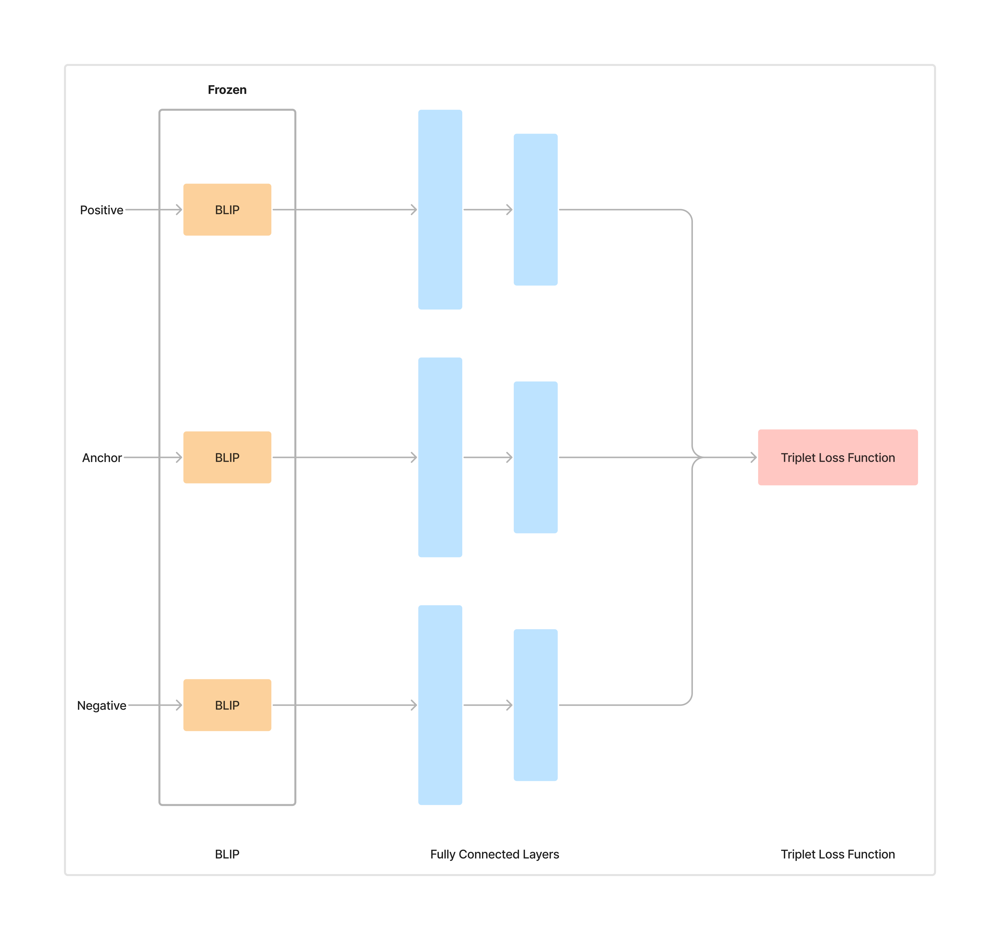
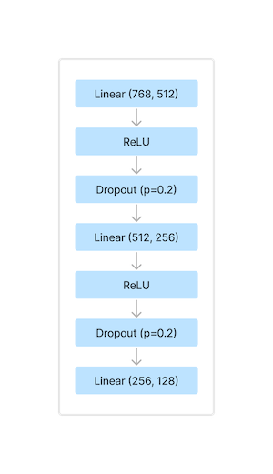
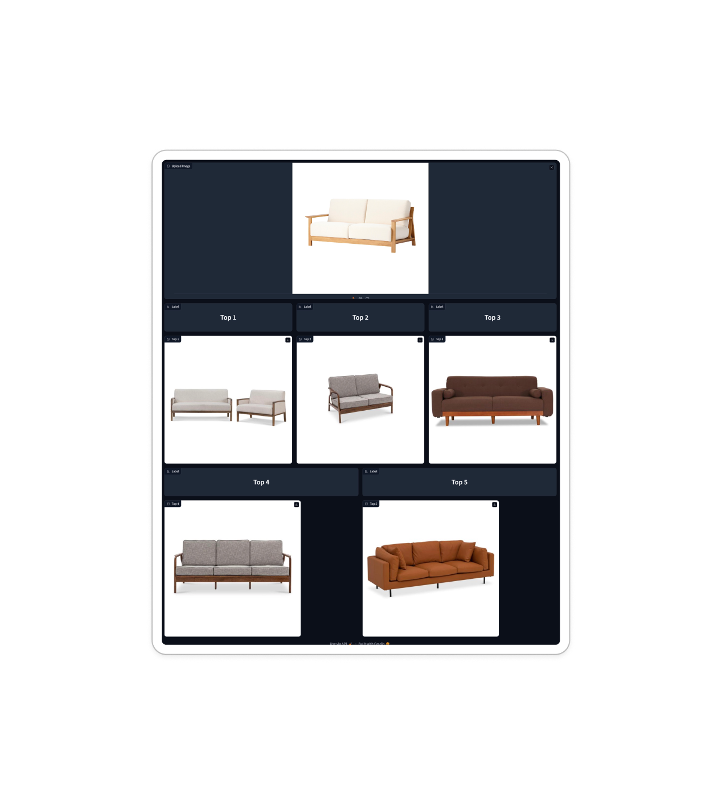

# Semantic furniture feature extraction and image search
A SUTD 50.038 Computational Data Science project by team decorAID

| Name                     | ID      |
|--------------------------|---------|
| Lim Sheng Xiang          | 1005005 |
| Bryce Goh Ying Ming      | 1005016 |
| Matthew Pohadi           | 1005379 |
| Mah Yi Da                | 1005024 |
| Ayu Permata Halim Mendoza| 1006069 |

# Overview
Our project focuses on enhancing reverse image search to help homeowners find market-available furniture that matches their mood board inspirations, specifically by refining the search and recommendation after detecting furniture items.

## Model

We used a Siamese network which accepts triplets images as input. In this, we froze the weights of the BLIP model, focusing our training efforts on the fully connected layers, accompanied by a triplet loss function at the end.

## Model architecture and hyper parameters used

    
    <table style="margin-left: 20px;"> 
        <tr>
            <th>Hyperparameter</th>
            <th>Value</th>
        </tr>
        <tr>
            <td>Learning Rate</td>
            <td>0.00000005</td>
        </tr>
        <tr>
            <td>Batch Size</td>
            <td>512</td>
        </tr>
        <tr>
            <td>Triplet Loss Margin</td>
            <td>1.0</td>
        </tr>
        <tr>
            <td>Dropout Rate</td>
            <td>0.2</td>
        </tr>
        <tr>
            <td>Epochs</td>
            <td>5</td>
        </tr>
    </table>

## Results
| Model   | Average Loss | Precision |
|---------|--------------|-----------|
| BLIP    | N/A          | 0.46      |
| Siamese | 0.409        | 0.45      |

Comparison of our Siamese model against the BLIP model in terms of average loss and precision.

## UI
Gradio app that provides an interactive way to find furniture that matches the style of a given input image. Utilising a trained Siamese neural network model, the app processes any uploaded image of furniture and displays the top five similar furniture piece from our database.

# Folder structure
`/app`
- Contains the application to run the Gradio app of our furniture recommendation system

`/furniture-labelling`
- Aggregate all furniture group labels after manual labelling on Figma

`/process-image`
- Downloading of all furniture images
- Resize and cropping of all furniture images to prepare them as input to our model

`/scrape-furniture`
- Collect all relevant data from an e-commerce website

`/training-evaluation`
- Contains all scripts related to training and evaluation of the model, including architecture and hyperparameter tuning.

## `/app`
`app.ipynb`\
To run the Gradio app of our furniture recommendation system.

`get-all-embeddings.ipynb`\
Get our custom model embeddings for all images in our dataset for use in our app.

More details can be found in [`/app/README.md`](/app/README.md)

## `/furniture-labelling`
`figma_labels.py`\
Aggregate the manually assigned group labels for all furniture, process and save it in the form of a JSON file.

## `/process-image`
`download-images.py`\
To download all furniture images from an e-commerce website.

`resize-crop-images.ipynb`\
To resize and crop all furniture images to a 512x512 pixel dimension, to serve as input to our custom Siamese model.

## `/scrape-furniture`
Collects relevant data of all furniture items from an e-commerce website which we are interested in.\
Categories include:
1. Sofas
2. Chairs
3. Tables
4. Beds
5. Storage

More details can be found in [`/scrape-furniture/README.md`](/scrape-furniture/README.md)

## `/training-evaluation`
`preprocess-blip.ipynb`\
Process all images with BLIP and obtain its embeddings. Embeddings will be stored in a csv file to act as cache for quicker training.

`split-datasets.ipynb`
- Split all images into our train, test and validation datasets, based on a 80/10/10 split.
- Generate two sets of triplets from the train dataset. First for the final training and the other, a reduced version of the first, for hyperparameter tuning.

`evaluate.ipynb`\
Evaluate the performance of our Siamese model with the test dataset, steps include:
- Calculating centroid embeddings of all groups in the train dataset
- Predict the group of all test images with the centroid embeddings
- Calculate the F1, precision and recall score
- Visualise the top 5 nearest neighbours for test images
- Visualise a dot cluster map of all train images and their respective groups

`train.ipynb`\
Training script for our full training dataset.

`tuning-evaluate.ipynb`\
Evaluate the performance of our Siamese model during hyperparameter tuning with the validation dataset.
Steps include:
- Calculating centroid embeddings of all groups in the reduced train dataset
- Predict the group of all validation images with the centroid embeddings
- Calculate the F1, precision and recall score
- Visualise the top 5 nearest neighbours for validation images
- Visualise a dot cluster map of train images and their respective groups

`tuning-train.ipynb`\
Training script with our reduced training dataset for hyperparameter tuning.